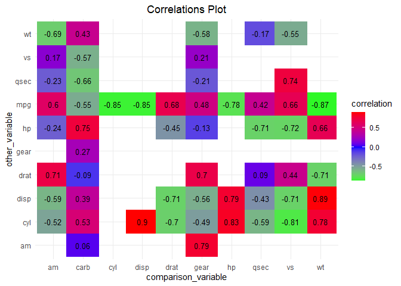
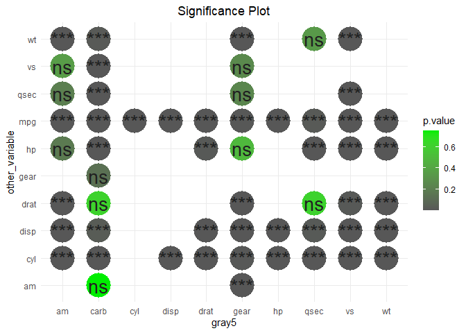

manymodelr: Build and Tune Several Models
================
2021-05-01

[](https://cran.r-project.org/package=manymodelr)
[](https://codecov.io/gh/Nelson-Gon/manymodelr?branch=develop)
[](https://doi.org/10.5281/zenodo.3891106)
[](https://travis-ci.com/Nelson-Gon/manymodelr)
[](https://github.com/Nelson-Gon/manymodelr)

[](https://www.gnu.org/licenses/gpl-3.0.en.html)
[](https://CRAN.R-project.org/package=manymodelr)
[](https://cran.r-project.org/package=manymodelr)
[](https://cran.r-project.org/package=manymodelr)
[](https://lifecycle.r-lib.org/articles/stages.html)
[](https://GitHub.com/Nelson-Gon/manymodelr/graphs/commit-activity)
[](https://www.repostatus.org/)
[](https://github.com/Nelson-Gon/manymodelr/commits/master)
[](https://GitHub.com/Nelson-Gon/manymodelr/issues/)
[](https://GitHub.com/Nelson-Gon/manymodelr/issues?q=is%3Aissue+is%3Aclosed)
[](https://isitmaintained.com/project/Nelson-Gon/manymodelr "Average time to resolve an issue")
[](https://makeapullrequest.com)

In this vignette, we take a look at how we can simplify many machine
learning tasks using `manymodelr`.

## Installation

``` r

install.packages("manymodelr")
```

Once the package has been successfully installed, we can then proceed by
loading the package and exploring some of the key functions.

**Loading the package**

``` r

library(manymodelr)
#> Loading required package: caret
#> Loading required package: lattice
#> Loading required package: ggplot2
#> Loading required package: Metrics
#> 
#> Attaching package: 'Metrics'
#> The following objects are masked from 'package:caret':
#> 
#>     precision, recall
#> Loading required package: e1071
#> Warning: package 'e1071' was built under R version 4.0.4
#> Welcome to manymodelr. This is manymodelr version 0.3.6.
#>  Please file issues and feedback at https://www.github.com/Nelson-Gon/manymodelr/issues
#> Turn this message off using 'suppressPackageStartupMessages(library(manymodelr))'
#>  Happy Modelling! :)

# data for examples
data("yields", package="manymodelr")
```

## Modeling

First, a word of caution. The examples shown in this section are meant
to simply show what the functions do and not what the best model is. For
a specific use case, please perform the necessary model checks, post-hoc
analyses, and/or choose predictor variables and model types as
appropriate based on domain knowledge.

With this in mind, let us look at how we can perform modeling tasks
using `manymodelr`.

  - **`multi_model_1`**

This is one of the core functions of the package. `multi_model_1` aims
to allow model fitting, prediction, and reporting with a single
function. The `multi` part of the function’s name reflects the fact that
we can fit several model types with one function. An example follows
next.

For purposes of this report, we create a simple dataset to use.

``` r
set.seed(520)
train_set<-createDataPartition(yields$normal,p=0.6,list=FALSE)
valid_set<-yields[-train_set,]
train_set<-yields[train_set,]
ctrl<-trainControl(method="cv",number=5)
m<-multi_model_1(train_set,"normal",".",c("knn","rpart"), 
                 "Accuracy",ctrl,new_data =valid_set)
```

The above returns a list containing metrics, predictions, and a model
summary. These can be extracted as shown below.

``` r

m$metric
#> # A tibble: 1 x 2
#>   knn_accuracy rpart_accuracy
#>          <dbl>          <dbl>
#> 1        0.872           0.68
```

``` r

head(m$predictions)
#> # A tibble: 6 x 2
#>   knn   rpart
#>   <chr> <chr>
#> 1 Yes   Yes  
#> 2 No    Yes  
#> 3 No    No   
#> 4 No    Yes  
#> 5 No    No   
#> 6 Yes   Yes
```

  - **multi\_model\_2**

This is similar to `multi_model_1` with one difference: it does not use
metrics such as RMSE, accuracy and the like. This function is useful if
one would like to fit and predict “simpler models” like generalized
linear models or linear models. Let’s take a look:

``` r
# fit a linear model and get predictions
lin_model <- multi_model_2(mtcars[1:16,],mtcars[17:32,],"mpg","wt","lm")

lin_model[c("predicted", "mpg")]
#>                     predicted  mpg
#> Mazda RX4            10.17314 21.0
#> Mazda RX4 Wag        24.32264 21.0
#> Datsun 710           26.95458 22.8
#> Hornet 4 Drive       25.96479 21.4
#> Hornet Sportabout    23.13039 18.7
#> Valiant              18.38390 18.1
#> Duster 360           18.76632 14.3
#> Merc 240D            16.94420 24.4
#> Merc 230             16.92171 22.8
#> Merc 280             25.51488 19.2
#> Merc 280C            24.59258 17.8
#> Merc 450SE           27.41348 16.4
#> Merc 450SL           19.95856 17.3
#> Merc 450SLC          21.75818 15.2
#> Cadillac Fleetwood   18.15895 10.4
#> Lincoln Continental  21.71319 10.4
```

From the above, we see that `wt` alone may not be a great predictor for
`mpg`. We can fit a multi-linear model with other predictors. Let’s say
`disp` and `drat` are important too, then we add those to the model.

``` r

multi_lin <- multi_model_2(mtcars[1:16, ], mtcars[17:32,],"mpg", "wt + disp + drat","lm")

multi_lin[,c("predicted", "mpg")]
#>                     predicted  mpg
#> Mazda RX4            10.43041 21.0
#> Mazda RX4 Wag        24.39765 21.0
#> Datsun 710           25.56629 22.8
#> Hornet 4 Drive       25.38957 21.4
#> Hornet Sportabout    23.15234 18.7
#> Valiant              17.36908 18.1
#> Duster 360           17.67102 14.3
#> Merc 240D            15.59802 24.4
#> Merc 230             14.96161 22.8
#> Merc 280             25.05592 19.2
#> Merc 280C            23.66222 17.8
#> Merc 450SE           25.95326 16.4
#> Merc 450SL           17.05637 17.3
#> Merc 450SLC          21.97756 15.2
#> Cadillac Fleetwood   17.22593 10.4
#> Lincoln Continental  22.17872 10.4
```

  - **`fit_model`**

This function allows us to fit any kind of model without necessarily
returning predictions.

``` r
lm_model <- fit_model(mtcars,"mpg","wt","lm")
lm_model
#> 
#> Call:
#> lm(formula = mpg ~ wt, data = use_df)
#> 
#> Coefficients:
#> (Intercept)           wt  
#>      37.285       -5.344
```

  - `fit_models`

This is similar to `fit_model` with the ability to fit many models with
many predictors at once. A simple linear model for instance:

``` r

models<-fit_models(df=yields,yname=c("height", "weight"),xname="yield",
                   modeltype="glm") 
```

One can then use these models as one may wish. To add residuals from
these models for example:

``` r


res_residuals <- lapply(models[[1]], add_model_residuals,yields)
res_predictions <- lapply(models[[1]], add_model_predictions, yields, yields)
# Get height predictions for the model height ~ yield 
head(res_predictions[[1]])
#>   normal    height     weight    yield predicted
#> 1    Yes 0.2849090 0.13442312 520.2837 0.5028866
#> 2     No 0.2427826 0.37484971 504.4754 0.4943626
#> 3    Yes 0.2579432 0.47134828 515.6463 0.5003860
#> 4     No 0.5175604 0.50143592 522.2247 0.5039331
#> 5    Yes 0.4026023 0.47171755 502.6406 0.4933732
#> 6     No 0.9789886 0.04191937 509.4663 0.4970537
```

If one would like to drop non-numeric columns from the analysis, one can
set `drop_non_numeric` to `TRUE` as follows. The same can be done for
`fit_model` above:

``` r
fit_models(df=yields,yname=c("height","weight"),
           xname=".",modeltype=c("lm","glm"), drop_non_numeric = TRUE)
#> [[1]]
#> [[1]][[1]]
#> 
#> Call:
#> lm(formula = height ~ ., data = use_df)
#> 
#> Coefficients:
#> (Intercept)       weight        yield  
#>   0.2176942   -0.2185572    0.0006712  
#> 
#> 
#> [[1]][[2]]
#> 
#> Call:
#> lm(formula = weight ~ ., data = use_df)
#> 
#> Coefficients:
#> (Intercept)       height        yield  
#>   0.0112753   -0.1463926    0.0006827  
#> 
#> 
#> 
#> [[2]]
#> [[2]][[1]]
#> 
#> Call:  glm(formula = height ~ ., data = use_df)
#> 
#> Coefficients:
#> (Intercept)       weight        yield  
#>   0.2176942   -0.2185572    0.0006712  
#> 
#> Degrees of Freedom: 999 Total (i.e. Null);  997 Residual
#> Null Deviance:       45.82 
#> Residual Deviance: 44.32     AIC: -270.3
#> 
#> [[2]][[2]]
#> 
#> Call:  glm(formula = weight ~ ., data = use_df)
#> 
#> Coefficients:
#> (Intercept)       height        yield  
#>   0.0112753   -0.1463926    0.0006827  
#> 
#> Degrees of Freedom: 999 Total (i.e. Null);  997 Residual
#> Null Deviance:       30.7 
#> Residual Deviance: 29.69     AIC: -671.1
```

## Extraction of Model Information

To extract information about a given model, we can use
`extract_model_info` as follows.

``` r

extract_model_info(lm_model, "r2")
#> [1] 0.7528328
```

To extract the adjusted R squared:

``` r

extract_model_info(lm_model, "adj_r2")
#> [1] 0.7445939
```

For the p value:

``` r

extract_model_info(lm_model, "p_value")
#>  (Intercept)           wt 
#> 8.241799e-19 1.293959e-10
```

To extract multiple attributes:

``` r

extract_model_info(lm_model,c("p_value","response","call","predictors"))
#> $p_value
#>  (Intercept)           wt 
#> 8.241799e-19 1.293959e-10 
#> 
#> $response
#> [1] "mpg"
#> 
#> $call
#> lm(formula = mpg ~ wt, data = use_df)
#> 
#> $predictors
#> [1] "wt"
```

This is not restricted to linear models but will work for most model
types. See `help(extract_model_info)` to see currently supported model
types.

## Correlations

  - `get_var_corr`

As can probably(hopefully) be guessed from the name, this provides a
convenient way to get variable correlations. It enables one to get
correlation between one variable and all other variables in the data
set.

**Previously, one would set `get_all` to `TRUE` if they wanted to get
correlations between all variables. This argument has been dropped in
favor of simply supplying an optional `other_vars` vector if one does
not want to get all correlations.**

Sample usage:

``` r

# getall correlations

# default pearson

head( corrs <- get_var_corr(mtcars,comparison_var="mpg") )
#>   comparison_var other_var      p.value correlation    lower_ci   upper_ci
#> 1            mpg       cyl 6.112687e-10  -0.8521620 -0.92576936 -0.7163171
#> 2            mpg      disp 9.380327e-10  -0.8475514 -0.92335937 -0.7081376
#> 3            mpg        hp 1.787835e-07  -0.7761684 -0.88526861 -0.5860994
#> 4            mpg      drat 1.776240e-05   0.6811719  0.43604838  0.8322010
#> 5            mpg        wt 1.293959e-10  -0.8676594 -0.93382641 -0.7440872
#> 6            mpg      qsec 1.708199e-02   0.4186840  0.08195487  0.6696186
```

**Previously, one would also set `drop_columns` to `TRUE` if they wanted
to drop factor columns.** Now, a user simply provides a character vector
specifying which column types(classes) should be dropped. It defaults to
`c("character","factor")`.

``` r

# purely demonstrative
get_var_corr(yields,"height",other_vars="weight",
             drop_columns=c("factor","character"),method="spearman",
             exact=FALSE)
#> Warning in get_var_corr.data.frame(yields, "height", other_vars = "weight", :
#> Columns with classes in drop_columns have been discarded. You can disable this
#> yourself by setting drop_columns to NULL.
#>   comparison_var other_var      p.value correlation
#> 1         height    weight 4.204642e-07  -0.1591719
```

Similarly, `get_var_corr_` (note the underscore at the end) provides a
convenient way to get combination-wise correlations.

``` r

head(get_var_corr_(yields),6)
#> Warning in get_var_corr_.data.frame(yields): Columns with classes in
#> drop_columns were dropped.
#>   comparison_var other_var      p.value correlation    lower_ci    upper_ci
#> 1         height    weight 1.470866e-08 -0.17793196 -0.23730741 -0.11723201
#> 2         height     yield 4.473683e-01  0.02405390 -0.03799584  0.08591886
#> 3         weight     yield 2.986171e-01  0.03290108 -0.02915146  0.09470100
```

To use only a subset of the data, we can use provide a list of columns
to `subset_cols`. By default, the first value(vector) in the list is
mapped to `comparison_var` and the other to `other_Var`. The list is
therefore of length 2.

``` r

head(get_var_corr_(mtcars,subset_cols=list(c("mpg","vs"),c("disp","wt")),
                   method="spearman",exact=FALSE))
#>   comparison_var other_var      p.value correlation
#> 2            mpg      disp 6.370336e-13  -0.9088824
#> 5            mpg        wt 1.487595e-11  -0.8864220
```

  - `plot_corr`

Obtaining correlations would mostly likely benefit from some form of
visualization. `plot_corr` aims to achieve just that. There are
currently two plot styles, `squares` and `circles`. `circles` has a
`shape` argument that can allow for more flexibility. It should be noted
that the correlation matrix supplied to this function is an object
produced by `get_var_corr_`.

To modify the plot a bit, we can choose to switch the x and y values as
shown below.

``` r


plot_corr(mtcars,show_which = "corr",
          round_which = "correlation",decimals = 2,x="other_var",  y="comparison_var",plot_style = "squares"
          ,width = 1.1,custom_cols = c("green","blue","red"),colour_by = "correlation")
#> Warning in plot_corr(mtcars, show_which = "corr", round_which = "correlation", :
#> Using colour_by for the legend title.
```

<!-- -->

To show significance of the results instead of the correlations
themselves, we can set `show_which` to “signif” as shown below. By
default, significance is set to 0.05. You can override this by supplying
a different `signif_cutoff`.

``` r
# color by p value
# change custom colors by supplying custom_cols
# significance is default 
set.seed(233)
plot_corr(mtcars, x="other_var", y="comparison_var",plot_style = "circles",show_which = "signif", colour_by = "p.value", sample(colours(),3))
#> Warning in plot_corr(mtcars, x = "other_var", y = "comparison_var", plot_style =
#> "circles", : Using colour_by for the legend title.
```

<!-- -->

To explore more options, please take a look at the documentation.

## Extra Functions

  - **`agg_by_group`**

As can be guessed from the name, this function provides an easy way to
manipulate grouped data. We can for instance find the number of
observations in the yields data set. The formula takes the form `x~y`
where `y` is the grouping variable(in this case `normal`). One can
supply a formula as shown next.

``` r

head(agg_by_group(yields,.~normal,length))
#> Grouped By[1]:   normal 
#> 
#>   normal height weight yield
#> 1     No    500    500   500
#> 2    Yes    500    500   500
```

``` r

head(agg_by_group(mtcars,cyl~hp+vs,sum))
#> Grouped By[2]:   hp vs 
#> 
#>    hp vs cyl
#> 1  91  0   4
#> 2 110  0  12
#> 3 150  0  16
#> 4 175  0  22
#> 5 180  0  24
#> 6 205  0   8
```

  - `rowdiff`

This is useful when trying to find differences between rows. The
`direction` argument specifies how the subtractions are made while the
`exclude` argument is used to specify classes that should be removed
before calculations are made. Using `direction="reverse"` performs a
subtraction akin to `x-(x-1)` where `x` is the row number.

``` r

head(rowdiff(yields,exclude = "factor",direction = "reverse"))
#>        height      weight      yield
#> 1          NA          NA         NA
#> 2 -0.04212634  0.24042659 -15.808303
#> 3  0.01516059  0.09649856  11.170825
#> 4  0.25961718  0.03008764   6.578424
#> 5 -0.11495811 -0.02971837 -19.584090
#> 6  0.57638627 -0.42979818   6.825719
```

  - `na_replace`

This allows the user to conveniently replace missing values. Current
options are `ffill` which replaces with the next non-missing value,
`samples` that samples the data and does replacement, `value` that
allows one to fill `NA`s with a specific value. Other common
mathematical methods like `min`, `max`,`get_mode`, `sd`, etc are no
longer supported. They are now available with more flexibility in
standalone [manymodelr](https://github.com/Nelson-Gon/manymodelr)

``` r

head(na_replace(airquality, how="value", value="Missing"),8)
#>     Ozone Solar.R Wind Temp Month Day
#> 1      41     190  7.4   67     5   1
#> 2      36     118  8.0   72     5   2
#> 3      12     149 12.6   74     5   3
#> 4      18     313 11.5   62     5   4
#> 5 Missing Missing 14.3   56     5   5
#> 6      28 Missing 14.9   66     5   6
#> 7      23     299  8.6   65     5   7
#> 8      19      99 13.8   59     5   8
```

  - `na_replace_grouped`

This provides a convenient way to replace values by group.

``` r
test_df <- data.frame(A=c(NA,1,2,3), B=c(1,5,6,NA),groups=c("A","A","B","B"))
# Replace NAs by group
# replace with the next non NA by group.
na_replace_grouped(df=test_df,group_by_cols = "groups",how="ffill")
#>   groups A B
#> 1      A 1 1
#> 2      A 1 5
#> 3      B 2 6
#> 4      B 3 6
```

The use of `mean`,`sd`,etc is no longer supported. Use
[mde](https://github.com/Nelson-Gon/mde) instead which is focused on
missingness.

-----

**Exploring Further**

The vignette has been short and therefore is non exhaustive. The best
way to explore this and any package or language is to practise. For more
examples, please use `?function_name` and see a few implementations of
the given function.

**Reporting Issues**

If you would like to contribute, report issues or improve any of these
functions, please raise a pull request at
([manymodelr](https://github.com/Nelson-Gon/manymodelr))

> “Programs must be written for people to read, and only incidentally
> for machines to execute.” - Harold Abelson
> ([Reference](https://www.goodreads.com/quotes/tag/programming))

**Thank You**
