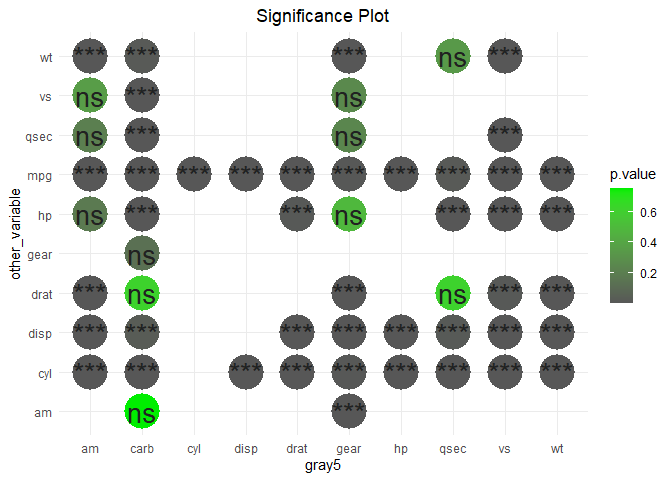

2020-09-09

# `manymodelr`: Build and Tune Several Models

[](https://cran.r-project.org/package=manymodelr)
[](https://codecov.io/gh/Nelson-Gon/manymodelr?branch=develop)
[](https://doi.org/10.5281/zenodo.3891106)
[](https://travis-ci.org/Nelson-Gon/manymodelr)
[](https://github.com/Nelson-Gon/manymodelr)

[](https://www.gnu.org/licenses/old-licenses/gpl-2.0.html)
[](http://www.rdocumentation.org/packages/manymodelr)
[](https://cran.r-project.org/package=manymodelr)
[](https://cran.r-project.org/package=manymodelr)
[](https://www.tidyverse.org/lifecycle/#stable)
[](https://GitHub.com/Nelson-Gon/manymodelr/graphs/commit-activity)
[](http://www.repostatus.org/#active)
[](https://github.com/Nelson-Gon/manymodelr/commits/master)
[](https://GitHub.com/Nelson-Gon/manymodelr/issues/)
[](https://GitHub.com/Nelson-Gon/manymodelr/issues?q=is%3Aissue+is%3Aclosed)
[](http://isitmaintained.com/project/Nelson-Gon/manymodelr "Average time to resolve an issue")
[](http://makeapullrequest.com)

In this vignette, we take a look at how we can simplify many machine
learning tasks using `manymodelr`. We will take a look at the core
functions first.

**Installing the package**

``` r

install.packages("manymodelr")
```

Once the package has been successfully installed, we can then proceed by
loading the package and exploring some of the key functions.

**Loading the package**

``` r

library(manymodelr)
#> Loading required package: caret
#> Loading required package: lattice
#> Loading required package: ggplot2
#> Warning: package 'ggplot2' was built under R version 4.0.2
#> Loading required package: Metrics
#> 
#> Attaching package: 'Metrics'
#> The following objects are masked from 'package:caret':
#> 
#>     precision, recall
#> Loading required package: e1071
#> Welcome to manymodelr.
#> For the latest development version,
#> please see: https://www.github.com/Nelson-Gon/manymodelr.
#> Please file issues at https://github.com/Nelson-Gon/manymodelr/issues
```

**Sample Usage of Key Functions**

  - **`agg_by_group`**

As can be guessed from the name, this function provides an easy way to
manipulate grouped data. We can for instance find the number of
observations in the iris data set. The formula takes the form `x~y`
where `y` is the grouping variable(in this case `Species`). One can
supply a formula as shown next.

``` r

head(agg_by_group(iris,.~Species,length))
#> Grouped By[1]:   Species 
#> 
#>      Species Sepal.Length Sepal.Width Petal.Length Petal.Width
#> 1     setosa           50          50           50          50
#> 2 versicolor           50          50           50          50
#> 3  virginica           50          50           50          50
```

``` r

head(agg_by_group(mtcars,cyl~hp+vs,sum))
#> Grouped By[2]:   hp vs 
#> 
#>    hp vs cyl
#> 1  91  0   4
#> 2 110  0  12
#> 3 150  0  16
#> 4 175  0  22
#> 5 180  0  24
#> 6 205  0   8
```

  - **`multi_model_1`**

This is one of the core functions of the package. To avoid, several
messages showing up, we use the function `suppressMessages`. This
assumes that one is familiar with machine learning basics.

``` r

set.seed(520)
train_set<-createDataPartition(iris$Species,p=0.8,list=FALSE)
valid_set<-iris[-train_set,]
train_set<-iris[train_set,]
ctrl<-trainControl(method="cv",number=5)
m<-multi_model_1(train_set,"Species",".",c("knn","rpart"), "Accuracy",ctrl,new_data =valid_set)
```

The above message tells us that the model has returned our metrics for
each of the model types we specified. These can be extracted as shown
below. Other return values include predictions and a summary of the
model.

``` r

m$metric
#> # A tibble: 1 x 2
#>   knn_accuracy rpart_accuracy
#>          <dbl>          <dbl>
#> 1            1          0.933
```

``` r

head(m$predictions)
#> # A tibble: 6 x 2
#>   knn    rpart 
#>   <chr>  <chr> 
#> 1 setosa setosa
#> 2 setosa setosa
#> 3 setosa setosa
#> 4 setosa setosa
#> 5 setosa setosa
#> 6 setosa setosa
```

  - **multi\_model\_2**

This is similar to `multi_model_1` with one difference: it does not use
metrics such as RMSE, accuracy and the like. This function is useful if
one would like to fit and predict “simpler models” like generalized
linear models or linear models. Let’s take a look:

``` r
# fit a linear model and get predictions
lin_model <- multi_model_2(iris[1:50,],iris[50:99,],"Sepal.Length","Petal.Length","lm")

head(lin_model)
#>   Sepal.Length Sepal.Width Petal.Length Petal.Width Species predicted
#> 1          5.1         3.5          1.4         0.2  setosa  4.972378
#> 2          4.9         3.0          1.4         0.2  setosa  6.761943
#> 3          4.7         3.2          1.3         0.2  setosa  6.653485
#> 4          4.6         3.1          1.5         0.2  setosa  6.870402
#> 5          5.0         3.6          1.4         0.2  setosa  6.382339
#> 6          5.4         3.9          1.7         0.4  setosa  6.707714
```

We can also fit a multilinear model as shown below:

``` r

head(multi_model_2(iris[1:50,],iris[50:99,],"Sepal.Length", "Petal.Length +Sepal.Width","lm"))
#>   Sepal.Length Sepal.Width Petal.Length Petal.Width Species predicted
#> 1          5.1         3.5          1.4         0.2  setosa  4.902999
#> 2          4.9         3.0          1.4         0.2  setosa  5.771541
#> 3          4.7         3.2          1.3         0.2  setosa  5.714857
#> 4          4.6         3.1          1.5         0.2  setosa  5.761483
#> 5          5.0         3.6          1.4         0.2  setosa  4.972473
#> 6          5.4         3.9          1.7         0.4  setosa  5.476232
```

To take this a step further, we can fit a model with the square of
Sepal.Width.

``` r

head(multi_model_2(iris[1:50,],iris[50:99,],"Sepal.Length","Petal.Length + I(Sepal.Width)**2","lm"))
#>   Sepal.Length Sepal.Width Petal.Length Petal.Width Species predicted
#> 1          5.1         3.5          1.4         0.2  setosa  4.902999
#> 2          4.9         3.0          1.4         0.2  setosa  5.771541
#> 3          4.7         3.2          1.3         0.2  setosa  5.714857
#> 4          4.6         3.1          1.5         0.2  setosa  5.761483
#> 5          5.0         3.6          1.4         0.2  setosa  4.972473
#> 6          5.4         3.9          1.7         0.4  setosa  5.476232
```

The above function does more and can fit and predict on any model type.
Exploration is therefore left to the reader.

  - **`fit_model`**

This function allows us to fit any kind of model without. It replaces
`modeleR` which had several issues and development was discontinued.

``` r
iris1 <- iris[1:50,]
iris2 <- iris[51:100,]
lm_model <- fit_model(iris1,"Sepal.Length","Petal.Length","lm")
lm_model
#> 
#> Call:
#> lm(formula = Sepal.Length ~ Petal.Length, data = df)
#> 
#> Coefficients:
#>  (Intercept)  Petal.Length  
#>       4.2132        0.5423
```

To extract information about the model, we can use `extract_model_info`
as follows. Say we wanted to extract the R squared value, we would
proceed as follows:

``` r

extract_model_info(lm_model, "r2")
#> [1] 0.07138289
```

To extract the adjusted R squared:

``` r

extract_model_info(lm_model, "adj_r2")
#> [1] 0.0520367
```

For the p value:

``` r

extract_model_info(lm_model, "p_value")
#>  (Intercept) Petal.Length 
#> 1.614927e-13 6.069778e-02
```

To extract multiple attributes:

``` r

extract_model_info(lm_model,c("p_value","response","call","predictors"))
#> $p_value
#>  (Intercept) Petal.Length 
#> 1.614927e-13 6.069778e-02 
#> 
#> $response
#> [1] "Sepal.Length"
#> 
#> $call
#> lm(formula = Sepal.Length ~ Petal.Length, data = df)
#> 
#> $predictors
#> [1] "Petal.Length"
```

This is not restricted to linear models but will work for most model
types. See `help(extract_model_info)` to see currently supported model
types.

To add predictions to our data set, we can use `add_model_predictions`
as follows:

``` r
# select only column 6 that has our predicted values

head(add_model_predictions(lm_model, old_data = iris1, new_data =  iris2))[6]
#>   predicted
#> 1  6.761943
#> 2  6.653485
#> 3  6.870402
#> 4  6.382339
#> 5  6.707714
#> 6  6.653485
```

To do the same with `dplyr`, one can work as follows:

``` r

library(dplyr)
#> 
#> Attaching package: 'dplyr'
#> The following objects are masked from 'package:stats':
#> 
#>     filter, lag
#> The following objects are masked from 'package:base':
#> 
#>     intersect, setdiff, setequal, union
iris1 %>% 
  add_model_predictions(model=lm_model,new_data = iris2) %>% 
  select(predicted, everything()) %>% 
  head()
#>   predicted Sepal.Length Sepal.Width Petal.Length Petal.Width Species
#> 1  6.761943          5.1         3.5          1.4         0.2  setosa
#> 2  6.653485          4.9         3.0          1.4         0.2  setosa
#> 3  6.870402          4.7         3.2          1.3         0.2  setosa
#> 4  6.382339          4.6         3.1          1.5         0.2  setosa
#> 5  6.707714          5.0         3.6          1.4         0.2  setosa
#> 6  6.653485          5.4         3.9          1.7         0.4  setosa
```

To add residuals to our data set, we can use `add_model_residuals`:

``` r
# 6 since residuals are added as the final column of the dataset

head(add_model_residuals(lm_model, iris1)[6])
#>     residuals
#> 1  0.12762214
#> 2 -0.07237786
#> 3 -0.21814860
#> 4 -0.42660712
#> 5  0.02762214
#> 6  0.26493436
```

With `dplyr`:

``` r

iris1 %>% 
  add_model_residuals(model=lm_model) %>% 
  add_model_predictions(new_data = iris2, model = lm_model) %>% 
  select(predicted,residuals, everything()) %>% 
  head()
#>   predicted   residuals Sepal.Length Sepal.Width Petal.Length Petal.Width
#> 1  6.761943  0.12762214          5.1         3.5          1.4         0.2
#> 2  6.653485 -0.07237786          4.9         3.0          1.4         0.2
#> 3  6.870402 -0.21814860          4.7         3.2          1.3         0.2
#> 4  6.382339 -0.42660712          4.6         3.1          1.5         0.2
#> 5  6.707714  0.02762214          5.0         3.6          1.4         0.2
#> 6  6.653485  0.26493436          5.4         3.9          1.7         0.4
#>   Species
#> 1  setosa
#> 2  setosa
#> 3  setosa
#> 4  setosa
#> 5  setosa
#> 6  setosa
```

  - `fit_models`

This is similar to `fit_model` with the ability to fit many models with
many predictors at once. A simple linear model for instance:

``` r

( models<-fit_models(df=iris,yname=c("Sepal.Length","Sepal.Width"),xname="Petal.Length + Petal.Width",modeltype="lm") )
#> [[1]]
#> [[1]][[1]]
#> 
#> Call:
#> lm(formula = Sepal.Length ~ Petal.Length + Petal.Width, data = df)
#> 
#> Coefficients:
#>  (Intercept)  Petal.Length   Petal.Width  
#>       4.1906        0.5418       -0.3196  
#> 
#> 
#> [[1]][[2]]
#> 
#> Call:
#> lm(formula = Sepal.Width ~ Petal.Length + Petal.Width, data = df)
#> 
#> Coefficients:
#>  (Intercept)  Petal.Length   Petal.Width  
#>       3.5870       -0.2571        0.3640
```

One can then use these models as one may wish. To add residuals from
these models for example:

``` r

res<-lapply(models,add_model_residuals,iris)

head(res[[1]])
#>   Sepal.Length Sepal.Width Petal.Length Petal.Width Species
#> 1          5.1         3.5          1.4         0.2  setosa
#> 2          4.9         3.0          1.4         0.2  setosa
#> 3          4.7         3.2          1.3         0.2  setosa
#> 4          4.6         3.1          1.5         0.2  setosa
#> 5          5.0         3.6          1.4         0.2  setosa
#> 6          5.4         3.9          1.7         0.4  setosa
```

To fit several model types with different variables, one can do the
following:

``` r

fit_models(df=iris,yname=c("Sepal.Length","Sepal.Width"), xname="Petal.Length + Petal.Width",modeltype=c("lm","glm"))
#> [[1]]
#> [[1]][[1]]
#> 
#> Call:
#> lm(formula = Sepal.Length ~ Petal.Length + Petal.Width, data = df)
#> 
#> Coefficients:
#>  (Intercept)  Petal.Length   Petal.Width  
#>       4.1906        0.5418       -0.3196  
#> 
#> 
#> [[1]][[2]]
#> 
#> Call:
#> lm(formula = Sepal.Width ~ Petal.Length + Petal.Width, data = df)
#> 
#> Coefficients:
#>  (Intercept)  Petal.Length   Petal.Width  
#>       3.5870       -0.2571        0.3640  
#> 
#> 
#> 
#> [[2]]
#> [[2]][[1]]
#> 
#> Call:  glm(formula = Sepal.Length ~ Petal.Length + Petal.Width, data = df)
#> 
#> Coefficients:
#>  (Intercept)  Petal.Length   Petal.Width  
#>       4.1906        0.5418       -0.3196  
#> 
#> Degrees of Freedom: 149 Total (i.e. Null);  147 Residual
#> Null Deviance:       102.2 
#> Residual Deviance: 23.88     AIC: 158
#> 
#> [[2]][[2]]
#> 
#> Call:  glm(formula = Sepal.Width ~ Petal.Length + Petal.Width, data = df)
#> 
#> Coefficients:
#>  (Intercept)  Petal.Length   Petal.Width  
#>       3.5870       -0.2571        0.3640  
#> 
#> Degrees of Freedom: 149 Total (i.e. Null);  147 Residual
#> Null Deviance:       28.31 
#> Residual Deviance: 22.27     AIC: 147.6
```

If one would like to drop non-numeric columns from the analysis, one can
set `drop_non_numeric` to `TRUE` as follows. The same can be done for
`fit_model` above:

``` r
fit_models(df=iris,yname=c("Sepal.Length","Sepal.Width"),
           xname=".",modeltype=c("lm","glm"), drop_non_numeric = TRUE)
#> [[1]]
#> [[1]][[1]]
#> 
#> Call:
#> lm(formula = Sepal.Length ~ ., data = df)
#> 
#> Coefficients:
#>       (Intercept)        Sepal.Width       Petal.Length        Petal.Width  
#>            2.1713             0.4959             0.8292            -0.3152  
#> Speciesversicolor   Speciesvirginica  
#>           -0.7236            -1.0235  
#> 
#> 
#> [[1]][[2]]
#> 
#> Call:
#> lm(formula = Sepal.Width ~ ., data = df)
#> 
#> Coefficients:
#>       (Intercept)       Sepal.Length       Petal.Length        Petal.Width  
#>            1.6572             0.3778            -0.1876             0.6257  
#> Speciesversicolor   Speciesvirginica  
#>           -1.1603            -1.3983  
#> 
#> 
#> 
#> [[2]]
#> [[2]][[1]]
#> 
#> Call:  glm(formula = Sepal.Length ~ ., data = df)
#> 
#> Coefficients:
#>       (Intercept)        Sepal.Width       Petal.Length        Petal.Width  
#>            2.1713             0.4959             0.8292            -0.3152  
#> Speciesversicolor   Speciesvirginica  
#>           -0.7236            -1.0235  
#> 
#> Degrees of Freedom: 149 Total (i.e. Null);  144 Residual
#> Null Deviance:       102.2 
#> Residual Deviance: 13.56     AIC: 79.12
#> 
#> [[2]][[2]]
#> 
#> Call:  glm(formula = Sepal.Width ~ ., data = df)
#> 
#> Coefficients:
#>       (Intercept)       Sepal.Length       Petal.Length        Petal.Width  
#>            1.6572             0.3778            -0.1876             0.6257  
#> Speciesversicolor   Speciesvirginica  
#>           -1.1603            -1.3983  
#> 
#> Degrees of Freedom: 149 Total (i.e. Null);  144 Residual
#> Null Deviance:       28.31 
#> Residual Deviance: 10.33     AIC: 38.31
```

  - `get_var_corr`

As can probably(hopefully) be guessed from the name, this provides a
convenient way to get variable correlations. It enables one to get
correlation between one variable and all other variables in the data
set.

**Previously, one would set `get_all` to `TRUE` if they wanted to get
correlations between all variables. This argument has been dropped in
favor of simply supplying an optional `other_vars` vector if one does
not want to get all correlations.**

Sample usage:

``` r

# getall correlations

# default pearson

head( corrs <- get_var_corr(mtcars,comparison_var="mpg") )
#>   comparison_var other_var      p.value correlation    lower_ci   upper_ci
#> 1            mpg       cyl 6.112687e-10  -0.8521620 -0.92576936 -0.7163171
#> 2            mpg      disp 9.380327e-10  -0.8475514 -0.92335937 -0.7081376
#> 3            mpg        hp 1.787835e-07  -0.7761684 -0.88526861 -0.5860994
#> 4            mpg      drat 1.776240e-05   0.6811719  0.43604838  0.8322010
#> 5            mpg        wt 1.293959e-10  -0.8676594 -0.93382641 -0.7440872
#> 6            mpg      qsec 1.708199e-02   0.4186840  0.08195487  0.6696186
```

**Previously, one would also set `drop_columns` to `TRUE` if they wanted
to drop factor columns.** Now, a user simply provides a character vector
specifying which column types(classes) should be dropped. It defaults to
`c("character","factor")`.

``` r

# purely demonstrative
get_var_corr(iris,"Sepal.Length",other_vars="Petal.Length",drop_columns=c("factor","character"),method="spearman",
             exact=FALSE)
#> Warning in get_var_corr.data.frame(iris, "Sepal.Length", other_vars =
#> "Petal.Length", : Columns with classes in drop_columns have been discarded.
#> Youcan disable this yourself by setting drop_columns to NULL.
#>   comparison_var    other_var      p.value correlation
#> 1   Sepal.Length Petal.Length 3.443087e-50   0.8818981
```

Similarly, `get_var_corr_` (note the underscore at the end) provides a
convenient way to get combination-wise correlations.

``` r

head(get_var_corr_(mtcars),6)
#>   comparison_var other_var      p.value correlation    lower_ci   upper_ci
#> 1            mpg       cyl 6.112687e-10  -0.8521620 -0.92576936 -0.7163171
#> 2            mpg      disp 9.380327e-10  -0.8475514 -0.92335937 -0.7081376
#> 3            mpg        hp 1.787835e-07  -0.7761684 -0.88526861 -0.5860994
#> 4            mpg      drat 1.776240e-05   0.6811719  0.43604838  0.8322010
#> 5            mpg        wt 1.293959e-10  -0.8676594 -0.93382641 -0.7440872
#> 6            mpg      qsec 1.708199e-02   0.4186840  0.08195487  0.6696186
```

To use only a subset of the data, we can use provide a list of columns
to `subset_cols`. By default, the first value(vector) in the list is
mapped to `comparison_var` and the other to `other_Var`. The list is
therefore of length 2.

``` r

head(get_var_corr_(mtcars,subset_cols=list(c("mpg","vs"),c("disp","wt")),method="spearman",exact=FALSE))
#>   comparison_var other_var      p.value correlation
#> 2            mpg      disp 6.370336e-13  -0.9088824
#> 5            mpg        wt 1.487595e-11  -0.8864220
```

  - `plot_corr`

Obtaining correlations would mostly likely benefit from some form of
visualization. `plot_corr` aims to achieve just that. There are
currently two plot styles, `squares` and `circles`. `circles` has a
`shape` argument that can allow for more flexibility. It should be noted
that the correlation matrix supplied to this function is an object
produced by `get_var_corr_`.

To modify the plot a bit, we can choose to switch the x and y values as
shown below.

``` r


plot_corr(mtcars,show_which = "corr",
          round_which = "correlation",decimals = 2,x="other_var",  y="comparison_var",plot_style = "squares"
          ,width = 1.1,custom_cols = c("green","blue","red"),colour_by = "correlation")
#> Warning in plot_corr(mtcars, show_which = "corr", round_which = "correlation", :
#> Using colour_by for the legend title.
```

<!-- -->

To show significance of the results instead of the correlations
themselves, we can set `show_which` to “signif” as shown below. By
default, significance is set to 0.05. You can override this by supplying
a different `signif_cutoff`.

``` r
# color by p value
# change custom colors by supplying custom_cols
# significance is default 
set.seed(233)
plot_corr(mtcars, x="other_var", y="comparison_var",plot_style = "circles",show_which = "signif", colour_by = "p.value", sample(colours(),3))
#> Warning in plot_corr(mtcars, x = "other_var", y = "comparison_var", plot_style =
#> "circles", : Using colour_by for the legend title.
```

<!-- -->

To explore more options, please take a look at the documentation.

  - `rowdiff`

This is useful when trying to find differences between rows. The
`direction` argument specifies how the subtractions are made while the
`exclude` argument is used to specify classes that should be removed
before calculations are made. Using `direction="reverse"` performs a
subtraction akin to `x-(x-1)` where `x` is the row number.

``` r

head(rowdiff(iris,exclude = "factor",direction = "reverse"))
#>   Sepal.Length Sepal.Width Petal.Length Petal.Width
#> 1           NA          NA           NA          NA
#> 2         -0.2        -0.5          0.0         0.0
#> 3         -0.2         0.2         -0.1         0.0
#> 4         -0.1        -0.1          0.2         0.0
#> 5          0.4         0.5         -0.1         0.0
#> 6          0.4         0.3          0.3         0.2
```

  - `na_replace`

This allows the user to conveniently replace missing values. Current
options are `ffill` which replaces with the next non-missing value,
`samples` that samples the data and does replacement, `value` that
allows one to fill `NA`s with a specific value. Other common
mathematical methods like `min`, `max`,`get_mode`, `sd`, etc are no
longer supported. They are now available with more flexibility in
standalone [mde](https://www.github.com/Nelson-Gon/mde)

``` r

head(na_replace(airquality, how="value", value="Missing"),8)
#>     Ozone Solar.R Wind Temp Month Day
#> 1      41     190  7.4   67     5   1
#> 2      36     118  8.0   72     5   2
#> 3      12     149 12.6   74     5   3
#> 4      18     313 11.5   62     5   4
#> 5 Missing Missing 14.3   56     5   5
#> 6      28 Missing 14.9   66     5   6
#> 7      23     299  8.6   65     5   7
#> 8      19      99 13.8   59     5   8
```

  - `na_replace_grouped`

This provides a convenient way to replace values by group.

``` r
test_df <- data.frame(A=c(NA,1,2,3), B=c(1,5,6,NA),groups=c("A","A","B","B"))
# Replace NAs by group
# replace with the next non NA by group.
na_replace_grouped(df=test_df,group_by_cols = "groups",how="ffill")
#>   groups A B
#> 1      A 1 1
#> 2      A 1 5
#> 3      B 2 6
#> 4      B 3 6
```

The use of `mean`,`sd`,etc is no longer supported. Use
[mde](https://www.github.com/Nelson-Gon/mde) instead which is focused on
missingness.

-----

**Exploring Further**

The vignette has been short and therefore is non exhaustive. The best
way to explore this and any package or language is to practise. For more
examples, please use `?function_name` and see a few implementations of
the given function.

**Reporting Issues**

If you would like to contribute, report issues or improve any of these
functions, please raise a pull request at
([manymodelr](https://www.github.com/Nelson-Gon/manymodelr))

> “Programs must be written for people to read, and only incidentally
> for machines to execute.” - Harold Abelson
> ([Reference](https://www.goodreads.com/quotes/tag/programming))

**Thank You**
